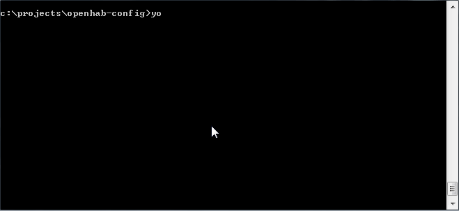

# Yeoman openHAB Generator [![NPM version][npm-image]][npm-url] [![Build Status][travis-image]][travis-url] [![Dependency Status][daviddm-image]][daviddm-url] [![Donate][paypal-image]][paypal-url]
> This is a command-line tool that generates openHAB items, sitemap and a [HABPanel](https://github.com/openhab/org.openhab.ui.habpanel) dashboard for your home.
[openHAB](http://openhab.org/) is a vendor and techology agnostic open source automation software for your home.



With this generator you'll set up your smart home with a least amount of work.
Simply provide some details on how your house is structured:

1. How many floors are in your house
1. Select the rooms on each floor (e.g. `Kitchen`, `Living room` and `Bathroom`)
1. Assign smart devices to each room
1. Done!

As a result this generator will produce an `your-home-name.items` file 
along with `your-home-name.sitemap` and a HABPanel json file that you can later export.

## Installation

First, install [Yeoman](http://yeoman.io) and generator-openhab using [npm](https://www.npmjs.com/) (we assume you have pre-installed [node.js](https://nodejs.org/)).

```bash
npm i -g yo generator-openhab
```

Then go to your `openhab-config/` folder and generate your files:

```bash
cd /etc/openhab2
yo openhab
```

## License

MIT © [kubawolanin](http://www.kubawolanin.com)


[npm-image]: https://badge.fury.io/js/generator-openhab.svg
[npm-url]: https://npmjs.org/package/generator-openhab
[travis-image]: https://travis-ci.org/kubawolanin/generator-openhab.svg?branch=master
[travis-url]: https://travis-ci.org/kubawolanin/generator-openhab
[daviddm-image]: https://david-dm.org/kubawolanin/generator-openhab.svg?theme=shields.io
[daviddm-url]: https://david-dm.org/kubawolanin/generator-openhab
[paypal-image]: https://img.shields.io/badge/Donate-PayPal-green.svg
[paypal-url]: https://www.paypal.com/cgi-bin/webscr?cmd=_donations&business=3U4AR5PXBTWH4&lc=US&currency_code=PLN&bn=PP%2dDonationsBF%3abtn_donate_LG%2egif%3aNonHosted